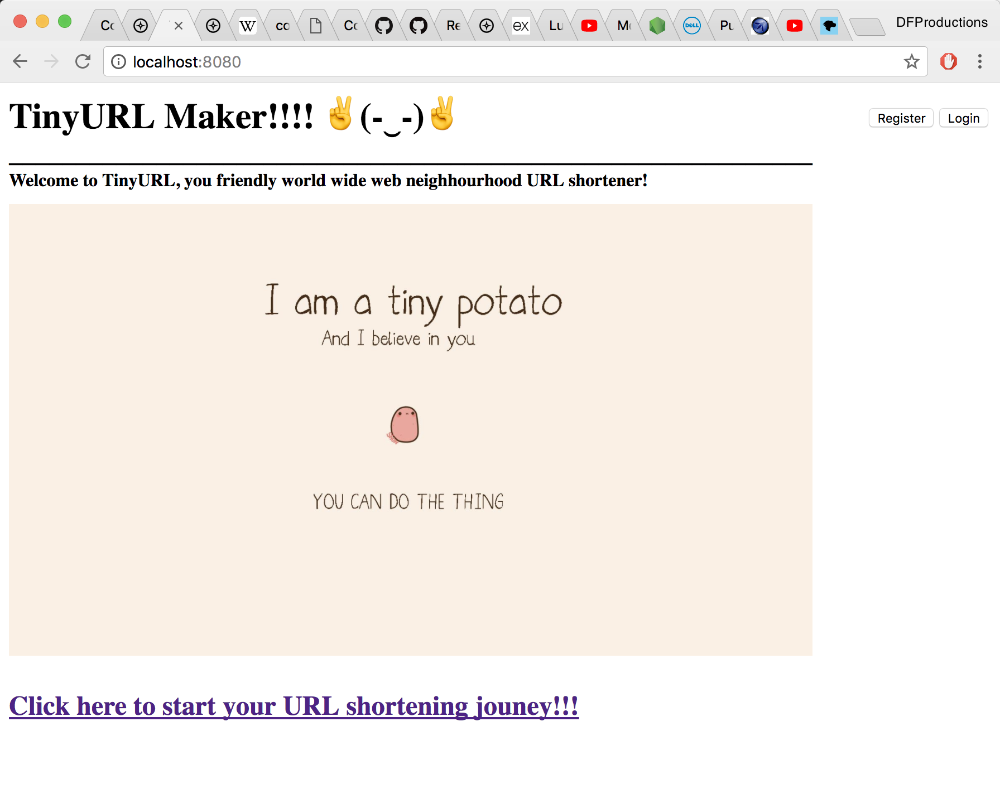
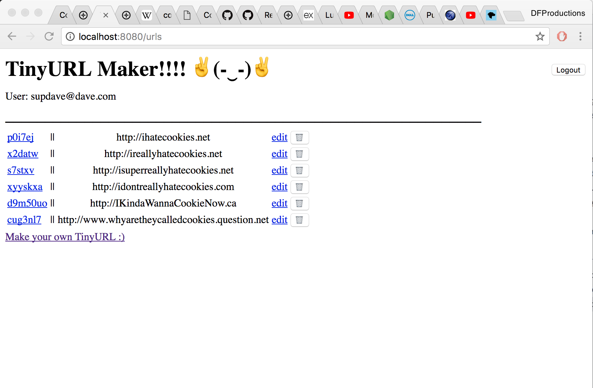

# My first coding project

# TinyApp Project

A simple URL shortening app.

TinyApp is a full stack web application built with Node and Express that allows users to shorten long URLs (à la bit.ly).

## Final Product

Designed to function as a website.
It will generate a shortened "URL" for a given URL.
It also employs session control via cookies to provide a personalized experience for every user.

## Dependencies

- Node.js
- Express
- EJS
- bcrypt
- body-parser
- cookie-session

## Getting Started

- Install all dependencies (using the `npm install` command).
- Run the development web server using the `node express_server.js` command.

## Notes - Criteria Deviations

I added a few extra features to my App as listed below:

1. - the "/"" homepage is a "landing" page. It does will not redirect to either "/urls" nor "/login". However links are provided to go to both of those pages depending on whether or not a user is logged in.

2. - At the "/login" page, if the inputted email is not in the user database, it will automatically redirect the user to the "/register" page to register.

3. - If a user tries to access a page to which they are not supposed to have access, TinyApp will automatically redirect the user to the "/login" page.

4. - When a user logs out, TinyApp will redirect to the landing page "/" rather than "/urls".